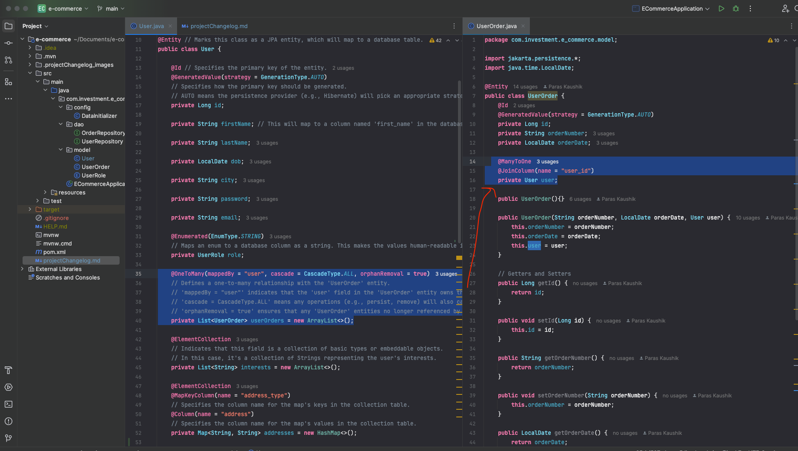
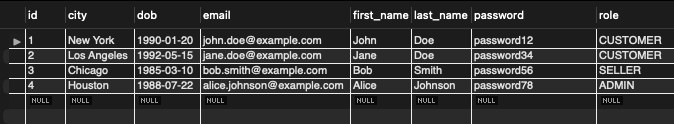
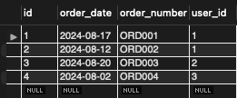
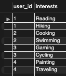
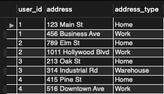

### Project Overview

The project is an e-commerce application using Spring Boot and Spring Data JPA to manage users and their orders. The main entities in the application are `User` and `UserOrder`. The application demonstrates the following key concepts:

1. **Entity Mapping**: The `User` and `UserOrder` classes are mapped to database tables using JPA annotations like `@Entity`, `@Id`, `@GeneratedValue`, `@OneToMany`, `@ManyToOne`, `@ElementCollection`, etc.

2. **Repository Interfaces**: The `UserRepository` and `OrderRepository` interfaces extend `JpaRepository`, providing CRUD operations and custom finder methods.

3. **Data Persistence**: The application stores and retrieves `User` and `UserOrder` entities in a MySQL database.
## Repo layer


### Tables Created in MySQL

1. **`user` Table**:
    - **Columns**:
        
    - **Reason for Creation**: The `@Entity` annotation on the `User` class instructs JPA to create this table.

2. **`user_order` Table**:
    - **Columns**:
   
   
    - **Reason for Creation**: The `@Entity` annotation on the `UserOrder` class instructs JPA to create this table.

3. **`user_interests` Table**:
    - **Columns**:
   
    
    - **Reason for Creation**: The `@ElementCollection` annotation on the `interests` field in the `User` class instructs JPA to create this table.

4. **`user_addresses` Table**:
    - **Columns**:
   
        
    - **Reason for Creation**: The `@ElementCollection` annotation on the `addresses` field in the `User` class, combined with `@MapKeyColumn` and `@Column`, instructs JPA to create this table.

### Table creation Explanation

- **Entity Mapping to Tables**: The `@Entity` annotation on a class is what instructs JPA to create a corresponding table in the database. In the provided code, this annotation is used on the `User` and `UserOrder` classes, which leads to the creation of `user` and `user_order` tables, respectively.

- **Collection Tables**: The `@ElementCollection` annotation is used to create additional tables to store collections of basic types or embeddable objects. This leads to the creation of the `user_interests` and `user_addresses` tables for storing lists and maps, respectively.
 - The annotations we are using define relationships between the `User` and `UserOrder` entities in your application. These relationships are represented in the database using foreign keys (FK).

### `@ManyToOne` and `@JoinColumn`

```java
@ManyToOne
@JoinColumn(name = "user_id")
private User user;
```

- **`@ManyToOne`:** This annotation is used to define a many-to-one relationship between two entities. In this case, it means that many `UserOrder` entities can be associated with one `User`.

   - For example, a single user can have multiple orders, but each order is associated with only one user.

- **`@JoinColumn(name = "user_id")`:** This annotation specifies the name of the foreign key column in the `UserOrder` table that will reference the primary key of the `User` table.

   - The `user_id` column in the `UserOrder` table will store the ID of the user who placed the order.

### `@OneToMany` and `mappedBy`

```java
@OneToMany(mappedBy = "user", cascade = CascadeType.ALL, orphanRemoval = true)
private List<UserOrder> userOrders = new ArrayList<>();
```

- **`@OneToMany`:** This annotation defines a one-to-many relationship between two entities. In this case, it means that one `User` can have many `UserOrder` entities associated with it.

   - This is the inverse side of the relationship defined by `@ManyToOne` in `UserOrder`.

- **`mappedBy = "user"`:** This indicates that the `user` field in the `UserOrder` class owns the relationship. This means the `UserOrder` entity has a `user` field that references the `User` entity.

   - The `mappedBy` attribute is used to specify the field in the `UserOrder` class that refers to the owning side of the relationship. It tells Hibernate that the `UserOrder` entity already has a foreign key (`user_id`) defined by the `@JoinColumn` in the `UserOrder` class, so it doesn't need to create another foreign key in the `User` table.

### `cascade = CascadeType.ALL`

- **CascadeType.ALL:** This means that any operation performed on the `User` entity (like persist, merge, remove) will also be cascaded to the associated `UserOrder` entities. For example:
   - If you save a `User`, all their associated `UserOrder` entities will also be saved.
   - If you delete a `User`, all their associated `UserOrder` entities will also be deleted.

### `orphanRemoval = true`

- **orphanRemoval = true:** This means that if a `UserOrder` entity is no longer referenced by any `User`, it will be automatically removed from the database.
   - For example, if you remove an order from the `userOrders` list in a `User` entity and then save the `User`, that `UserOrder` entity will be deleted from the database.

### Example

Let's say you have a `User` with two orders:

- **User:** `id = 1, name = "John Doe"`
- **Orders:**
   - `Order 1`: `id = 100, orderNumber = "ORD001", user_id = 1`
   - `Order 2`: `id = 101, orderNumber = "ORD002", user_id = 1`

The `user_id` column in the `UserOrder` table (orders) references the `id` column in the `User` table. If you delete the `User`, both orders will also be deleted due to `cascade = CascadeType.ALL`. If you remove one of the orders from the `userOrders` list in the `User` entity, that order will be deleted from the database due to `orphanRemoval = true`.

Necessary to store the different attributes and relationships defined in the `User` and `UserOrder` classes.